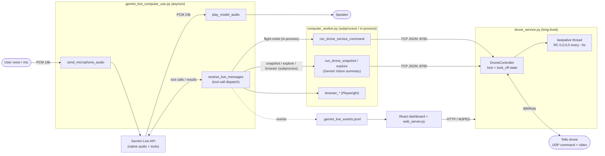
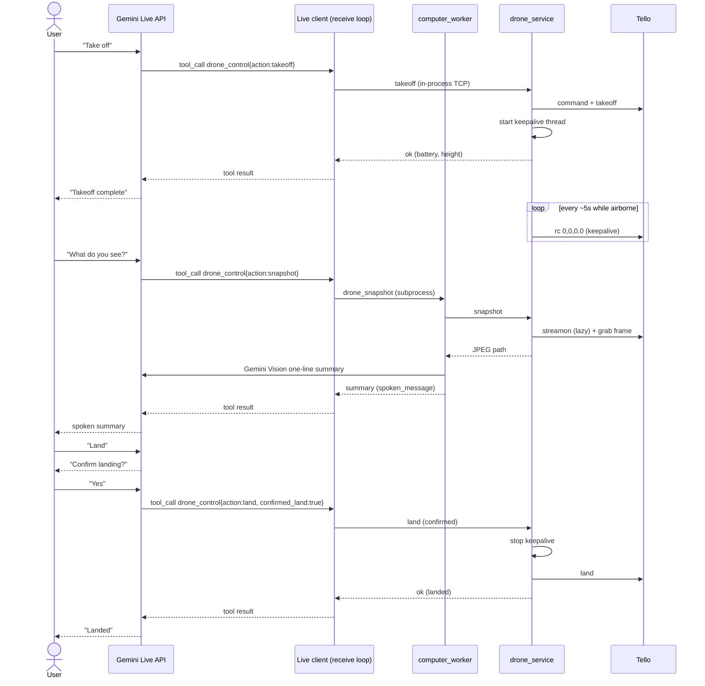

# drone-monitor

Control a DJI Tello drone with **voice and vision** using Gemini Live native
audio. Speak to the drone ("take off", "what do you see?", "land"); Gemini turns
speech into tool calls, a long-lived local service drives the Tello, and Gemini
Vision describes the live camera view. An optional React dashboard shows the
camera stream, telemetry, and a live event feed.

## Contents

- [Overview](#overview)
- [Architecture](#architecture)
- [Components](#components)
- [Prerequisites](#prerequisites)
- [Setup](#setup)
- [Running the live demo](#running-the-live-demo)
- [Voice commands](#voice-commands)
- [How it works](#how-it-works)
- [Command-line reference](#command-line-reference)
- [Configuration](#configuration)
- [Testing commands directly](#testing-commands-directly)
- [Browser computer-use](#browser-computer-use)
- [Legacy 360-degree capture](#legacy-360-degree-capture)
- [Troubleshooting](#troubleshooting)

## Overview

Three processes cooperate during the live demo:

1. **`gemini_live_computer_use.py`** streams your microphone to the Gemini Live
   API and plays Gemini's audio back. When Gemini decides to act, it emits a
   tool call that this client dispatches.
2. **`drone_service.py`** is a long-lived local service that owns the single
   Tello connection, the video stream, and the airborne state across many tool
   calls. This is what makes "what do you see?" fast — the drone never has to
   land and reconnect between commands.
3. **`computer_worker.py`** handles work that needs extra dependencies or
   environment: Gemini Vision summaries (`snapshot`, `explore`) and Playwright
   browser actions. Pure-flight commands skip the worker and talk to the service
   in-process for lower latency.

## Architecture



Key points:

- One long-lived `drone_service.py` owns the Tello connection, video stream, and
  airborne state across tool calls, serialized by a lock. A background keepalive
  thread sends a zero RC packet every few seconds so the firmware does not
  auto-land during quiet gaps.
- The Live client never blocks its event loop: worker calls and audio writes run
  in a thread executor, so microphone audio and websocket pings keep flowing.
- Pure-flight commands talk to the service in-process; vision (`snapshot`,
  `explore`) and `browser_*` run through `computer_worker.py`.

### Sequence: voice takeoff, look, and land



## Components

| File | Role |
| --- | --- |
| `gemini_live_computer_use.py` | Gemini Live native-audio client; mic capture, audio playback, and tool-call dispatch. |
| `drone_service.py` | Long-lived local service that owns the Tello connection, video stream, airborne state, and keepalive thread. |
| `computer_worker.py` | Allowlisted command runner for vision summaries, browser/computer actions, and a proxy to the drone service. |
| `web_server.py` | Dashboard API: serves telemetry, the throttled MJPEG stream, and the Gemini Live event feed. |
| `360_photo.py` | Legacy standalone 360-degree photo capture (opens its own Tello connection). |
| `simple.py` | Minimal standalone takeoff/land example. |
| `.gemini_live_events.jsonl` | Append-only event log shared between the Live client and the dashboard. |
| `drone_captures/<session-id>/` | Saved camera frames and photos per capture session. |

## Prerequisites

- Python 3.12
- Node.js (for the React dashboard)
- A DJI Tello drone, powered on, with this computer joined to its Wi-Fi network
- Gemini access via either a **Gemini Developer API key** or **Vertex AI**
  credentials
- On Linux, PortAudio for `sounddevice`:

  ```bash
  sudo apt install portaudio19-dev
  ```

## Setup

```bash
python3.12 -m venv venv
source venv/bin/activate
pip install -r requirements.txt
python -m playwright install chromium   # only needed for browser actions
npm install                             # only needed for the dashboard
```

## Running the live demo

### 1. Provide credentials

**Gemini Developer API** — set an API key:

```bash
export GEMINI_API_KEY="your-api-key"
```

**Vertex AI** — the Vertex Live endpoint requires OAuth / application-default
credentials (API keys are not accepted):

```bash
sudo apt-get update
sudo apt-get install -y apt-transport-https ca-certificates curl gnupg
curl https://packages.cloud.google.com/apt/doc/apt-key.gpg \
  | sudo gpg --dearmor -o /usr/share/keyrings/cloud.google.gpg
echo "deb [signed-by=/usr/share/keyrings/cloud.google.gpg] https://packages.cloud.google.com/apt cloud-sdk main" \
  | sudo tee /etc/apt/sources.list.d/google-cloud-sdk.list
sudo apt-get update
sudo apt-get install -y google-cloud-cli
export GOOGLE_CLOUD_PROJECT="your-project-id"
export GOOGLE_CLOUD_LOCATION="us-central1"
gcloud auth application-default login
```

Or use a service-account JSON instead of `gcloud auth application-default login`:

```bash
export GOOGLE_APPLICATION_CREDENTIALS="/path/to/service-account.json"
export GOOGLE_CLOUD_PROJECT="your-project-id"
export GOOGLE_CLOUD_LOCATION="us-central1"
```

### 2. Start the drone service

```bash
python3 drone_service.py
```

This keeps the Tello connection and camera stream open across Gemini tool calls.
Watch this terminal while debugging — flight commands are logged with sequence
numbers and a request source (`gemini_live`, `dashboard`, or `computer_worker`).
Frame requests are intentionally not logged because the video stream can request
frames continuously.

### 3. (Optional) start the dashboard

```bash
python3 web_server.py     # dashboard API
npm run dev               # React dashboard
```

Open `http://127.0.0.1:5173` for the live camera stream, telemetry, flight
controls, and Gemini Live event feed. The dashboard does **not** auto-start the
video stream — click `Start stream` only after the drone service is ready. The
MJPEG stream is throttled (default one frame per second) so camera requests do
not flood the same command path used for flight control:

```bash
STREAM_FRAME_INTERVAL_SECONDS=1.0 python3 web_server.py
```

### 4. Start Gemini Live

```bash
python3 gemini_live_computer_use.py            # Developer API
python3 gemini_live_computer_use.py --vertexai # Vertex AI
```

The client is interactive: it keeps listening after tool calls and reconnects
automatically if the Live receive stream ends. Flight status and the
duplicate-command cooldown persist across reconnects.

## Voice commands

```text
Take off.
Drone status.
Move forward.
Move left.
Go up.
Turn right.
Stop.
Explore the room.
What do you see?
Land.
```

Gemini Live uses a dedicated `drone_control` tool with a small action set:
`connect`, `status`, `takeoff`, `snapshot`, `explore`, `forward`, `back`,
`left`, `right`, `up`, `down`, `turn_left`, `turn_right`, `stop`, `land`, and
`shutdown`. This keeps drone control separate from the generic browser/computer
tool. The React `Take off` button and the voice command both go through the same
long-lived `drone_service.py` path.

If the dashboard button works but voice does not, restart
`gemini_live_computer_use.py` so it picks up the latest tool instructions, then
test the worker path directly with `drone_takeoff`.

## How it works

**Separate flight and video channels.** `takeoff` and movement use only the
Tello command channel; they do not send `streamon`. Video starts lazily only
when `snapshot`, `frame`, or the dashboard stream first requests a camera frame.

**Keepalive prevents auto-land.** The Tello firmware auto-lands if it receives no
command for about 15 seconds. After a successful `takeoff`, the service runs a
background keepalive thread that sends a zero RC packet every few seconds while
airborne, so the drone keeps hovering during quiet gaps between voice commands.
The heartbeat stops on `land` and `shutdown`. Override the interval with
`TELLO_KEEPALIVE_SECONDS`.

**Recovery from a stale state.** If the firmware does auto-land anyway (for
example the service was restarted while flying), the next `takeoff` re-checks
height telemetry and launches again instead of incorrectly reporting that the
drone is already airborne.

**Responsive event loop.** The Live client offloads worker calls and audio
writes to a thread executor, so microphone audio and websocket keepalive pings
keep flowing even while a tool call runs. It also flushes queued audio when you
interrupt, so the assistant stops talking over you.

**Tiny movements.** The Tello SDK's normal movement commands start at 20 cm, so
this project uses short RC-control pulses for 5 cm increments (15 degrees for
turns) and sends `stop` after every movement.

**Guided exploration.** Say `Explore the room` or `What should I do next?`;
Gemini captures the current view, suggests exactly one safe next action, and asks
for confirmation before moving. If you confirm, it executes only that one 5 cm
move or 15 degree turn.

**Duplicate suppression.** Accidental repeated drone actions are ignored for a
short cooldown (default 8 seconds) so Gemini does not loop on the same command:

```bash
DUPLICATE_DRONE_COMMAND_SECONDS=8 python3 gemini_live_computer_use.py --vertexai
```

**Landing confirmation.** Gemini cannot land on the first request — it must ask
`Confirm landing?` and only sends `land` after you explicitly confirm. The
dashboard uses the same two-step `Land` / `Confirm Land` flow.

**Concise spoken errors.** Drone errors return a short `spoken_message` plus
structured fields (`error_code`, `detail`, `recovery`). Gemini is instructed to
speak only the concise message and recovery, never raw SDK errors, tracebacks,
file paths, or JSON.

**Snapshots.** `drone_snapshot` captures one current Tello frame through the
service, saves it under `drone_captures/<session-id>/`, and asks Gemini Vision
for a short spoken summary.

## Command-line reference

### `gemini_live_computer_use.py`

| Flag | Description |
| --- | --- |
| `--api-key` | API key (defaults to `GEMINI_API_KEY` / `GOOGLE_API_KEY`). |
| `--vertexai` | Use Vertex AI instead of the Developer API endpoint. |
| `--project` / `--location` | Vertex project and location (default to env vars). |
| `--model` | Override the Live model ID. |
| `--api-version` | Live API version (Developer API defaults to `v1beta`). |
| `--list-live-models` | List models reporting `bidiGenerateContent`, then exit. |
| `--disable-tools` | Connect without function tools to isolate model/audio access. |
| `--program` | Worker program for tool calls (default `computer_worker.py`). |
| `--timeout` | Seconds to wait for the worker program (default `180`). |

Default models: Developer API `gemini-2.5-flash-native-audio-latest`; Vertex AI
`gemini-live-2.5-flash-native-audio`. Override if your account exposes a
different Live model:

```bash
python gemini_live_computer_use.py --model gemini-2.5-flash-native-audio-preview-12-2025
python gemini_live_computer_use.py --vertexai --model gemini-live-2.5-flash-native-audio
```

If a connection fails, list usable models or isolate tool support:

```bash
python gemini_live_computer_use.py --list-live-models
python gemini_live_computer_use.py --vertexai --list-live-models
python gemini_live_computer_use.py --disable-tools
```

You can also swap in a custom worker program (it must accept `--command` and
`--payload` and print a JSON result to stdout):

```bash
python gemini_live_computer_use.py --program ./my_worker.py
```

### `drone_service.py`

| Flag | Description |
| --- | --- |
| `--host` | Listen host (default `127.0.0.1`). |
| `--port` | Listen port (default `8765`). |

## Configuration

| Variable | Default | Used by | Purpose |
| --- | --- | --- | --- |
| `GEMINI_API_KEY` / `GOOGLE_API_KEY` | — | Live client, worker | Developer API key. |
| `GOOGLE_CLOUD_PROJECT` | — | Vertex AI | Google Cloud project. |
| `GOOGLE_CLOUD_LOCATION` | — | Vertex AI | Google Cloud location/region. |
| `GOOGLE_APPLICATION_CREDENTIALS` | — | Vertex AI | Service-account JSON path. |
| `TELLO_HOST` | `192.168.10.1` | drone service | Tello IP address. |
| `TELLO_RETRY_COUNT` | `1` | drone service | Tello command retries. |
| `TELLO_KEEPALIVE_SECONDS` | `5` | drone service | Keepalive heartbeat interval. |
| `TELLO_MOVE_RC_VELOCITY` | `20` | drone service | RC velocity for moves. |
| `TELLO_MOVE_RC_SECONDS` | `0.25` | drone service | Move pulse duration. |
| `TELLO_TURN_RC_VELOCITY` | `40` | drone service | RC velocity for turns. |
| `TELLO_TURN_RC_SECONDS` | `0.25` | drone service | Turn pulse duration. |
| `DRONE_SERVICE_HOST` | `127.0.0.1` | worker | Drone service host. |
| `DRONE_SERVICE_PORT` | `8765` | worker | Drone service port. |
| `DRONE_SERVICE_TIMEOUT_SECONDS` | `30` | worker | Socket timeout for service calls. |
| `STREAM_FRAME_INTERVAL_SECONDS` | `1.0` | web server | MJPEG stream throttle. |
| `DUPLICATE_DRONE_COMMAND_SECONDS` | `8` | Live client | Duplicate-command cooldown. |
| `GEMINI_LIVE_EVENT_LOG` | `.gemini_live_events.jsonl` | Live client, web server | Shared event log path. |
| `GEMINI_VISION_MODEL` | `gemini-2.5-flash` | worker | Model for vision summaries. |
| `COMPUTER_USE_HEADLESS` | auto | worker | Force headless/visible browser. |

The dashboard and Live client must agree on `GEMINI_LIVE_EVENT_LOG`; override it
for both processes if you move the log.

## Testing commands directly

Each drone action can be exercised through the worker (it proxies to the running
service):

```bash
python3 computer_worker.py --command drone_status
python3 computer_worker.py --command drone_takeoff
python3 computer_worker.py --command drone_forward
python3 computer_worker.py --command drone_left
python3 computer_worker.py --command drone_up
python3 computer_worker.py --command drone_turn_right
python3 computer_worker.py --command drone_stop
python3 computer_worker.py --command drone_explore
python3 computer_worker.py --command drone_snapshot
python3 computer_worker.py --command drone_land
```

Check connectivity to the drone:

```bash
python3 computer_worker.py --command drone_connect
```

## Browser computer-use

Browser actions are allowlisted in `computer_worker.py`, use Playwright, and
accept JSON payloads:

```bash
python computer_worker.py --command browser_open_url --payload '{"url":"https://example.com"}'
python computer_worker.py --command browser_search --payload '{"query":"Tello drone SDK docs"}'
python computer_worker.py --command browser_get_text
python computer_worker.py --command browser_screenshot
```

Set `COMPUTER_USE_HEADLESS=false` to force a visible browser window when a
desktop display is available. These require `python -m playwright install
chromium`.

## Legacy 360-degree capture

`drone_look_around` runs the standalone `360_photo.py` flow: a full 360-degree
capture sequence that lands at the end. Because it opens its own Tello
connection, it **cannot run while `drone_service.py` is up** (the socket clashes
and it would land the drone). Use `drone_snapshot` for the real-time demo, or
stop the service first. The same guard applies to `drone_run_simple`
(`simple.py`).

```bash
python computer_worker.py --command drone_run_simple --payload '{"timeout_seconds":60}'
python computer_worker.py --command drone_look_around --payload '{"timeout_seconds":120}'
```

Each look-around run stores its photos in a fresh `drone_captures/<session-id>/`
directory, so summaries only use images from the current run. If all four photos
are captured but the final cleanup rotation fails, the worker still summarizes
the current session photos and returns a warning.

## Troubleshooting

**Drone unreachable.** If `drone_service.py` repeatedly logs `Aborting command
'command'. Did not receive a response after 7 seconds`, the service is running
but the Tello is not reachable. Confirm the drone is powered on, this computer is
on the Tello Wi-Fi network, and no other script is already connected. Then retry:

```bash
python3 computer_worker.py --command drone_connect
```

Override the target or retry count if needed:

```bash
TELLO_HOST=192.168.10.1 TELLO_RETRY_COUNT=1 python3 drone_service.py
```

**Vertex AI rejects an API key.** The Vertex Live endpoint needs OAuth /
application-default credentials. Run `gcloud auth application-default login` and
set `GOOGLE_CLOUD_PROJECT` / `GOOGLE_CLOUD_LOCATION`.

**Developer API key blocked.** If you see `API_KEY_SERVICE_BLOCKED`, the key may
be a Vertex key — rerun with `--vertexai`.

**Live connection fails.** List usable models with `--list-live-models`, and
isolate native-audio access from function calling with `--disable-tools`.

**`Address already in use`.** A legacy command (`drone_run_simple` /
`drone_look_around`) tried to open the Tello socket while `drone_service.py` was
running. Stop the service first, or use the live `drone_control` actions.

**Browser action fails with "Executable doesn't exist".** Run
`python -m playwright install chromium`.

**No audio / PortAudio errors.** Install PortAudio (`sudo apt install
portaudio19-dev`) and reinstall dependencies if needed.
