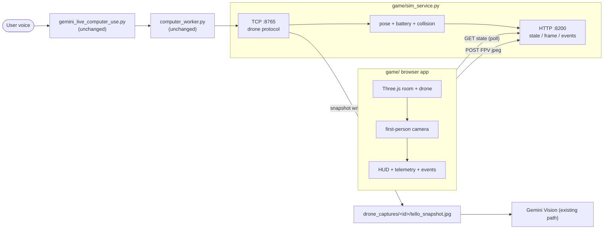

# Drone Simulator Game

A browser-based 3D drone simulator flown entirely **by voice** through the same
Gemini Live stack that controls the real Tello. It exists so you can demo the
whole project without a physical drone (or a Tello Wi-Fi network).

The trick: `sim_service.py` speaks the **exact** TCP protocol of
[`drone_service.py`](../drone_service.py) on port `8765`, so
`gemini_live_computer_use.py` and `computer_worker.py` drive the simulated drone
with **zero code changes**. The browser renders a room in Three.js, and the
drone's first-person camera is pushed back to the service so "what do you see?"
and explore mode summarize the *simulated* scene.

## Architecture



## Files

| File | Purpose |
| --- | --- |
| `layout.json` | Room dimensions + obstacle boxes. Shared by the service (collision) and the browser (rendering) so physics and visuals match. |
| `sim_service.py` | TCP `:8765` drone-protocol service + HTTP `:8200` browser API. Physics authority. |
| `index.html`, `src/main.js`, `src/scene.js`, `src/style.css` | Vite + Three.js renderer (pure renderer; the service owns the truth). |

## Run

Open three terminals from the repo root:

```bash
# 1. Simulator service (TCP :8765 + HTTP :8200) — run INSTEAD of drone_service.py
python game/sim_service.py

# 2. Browser game (http://127.0.0.1:5174)
cd game && npm install && npm run dev

# 3. Voice client (unchanged)
python gemini_live_computer_use.py --vertexai
```

Then open `http://127.0.0.1:5174` and speak:

> "Take off" - "Turn right" - "Go up" - "What do you see?" - "Explore the room" - "Land"

Telemetry and the Gemini Live event feed update live in the HUD, and the
first-person inset (bottom-left) is exactly what the vision model summarizes.

## How it maps to the real drone

- **Movement parity:** 5 cm translations and 15° turns, `takeoff` lifts to
  ~70 cm, `land` returns to the floor — identical increments to
  `drone_service.py`.
- **Collision:** moves that would hit a wall or an obstacle box are refused and
  the drone says what blocked it (the real Tello has no collision detection, so
  this is a sim-only nicety).
- **Vision:** `snapshot`/`frame` use the latest browser-rendered FPV JPEG, saved
  to the same `drone_captures/<session>/tello_snapshot.jpg` path the real
  snapshot uses, so the existing Gemini Vision flow is untouched.

## Configuration

| Variable | Default | Effect |
| --- | --- | --- |
| `DRONE_SERVICE_PORT` | `8765` | TCP port (must match what `computer_worker.py` targets). |
| `SIM_HTTP_PORT` | `8200` | HTTP API port for the browser. |
| `GEMINI_LIVE_EVENT_LOG` | `../.gemini_live_events.jsonl` | Event log tailed by `/events` for the HUD. |
| `VITE_SIM_API` | `http://127.0.0.1:8200` | Browser override for the service URL. |

## Notes

- Do **not** run `drone_service.py` and `sim_service.py` at the same time — both
  bind TCP `:8765`.
- For a livelier sandbox demo you can set `DRONE_EXPLORE_SAFE_MODE=0` so explore
  may suggest translation moves (there's no real audience to protect).
- Sandbox only — no scoring or mission layer.
